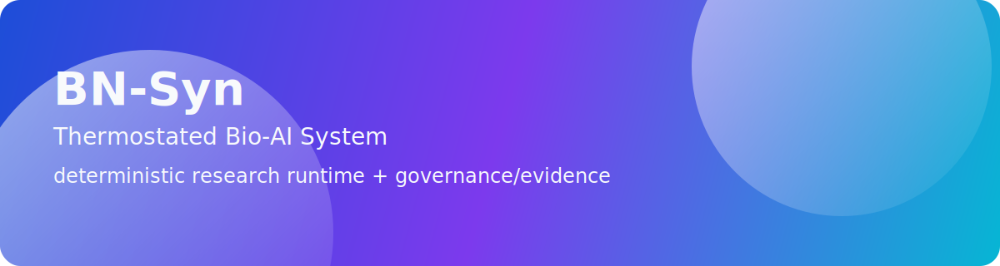
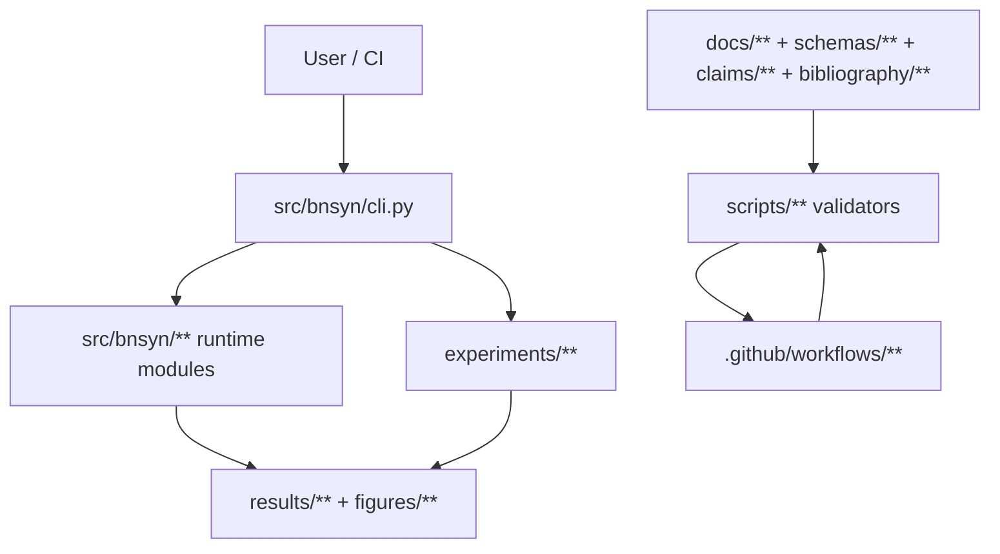

# BN-Syn Thermostated Bio-AI System



[](https://github.com/neuron7x/bnsyn-phase-controlled-emergent-dynamics/actions/workflows/ci-pr.yml)
[](https://github.com/neuron7x/bnsyn-phase-controlled-emergent-dynamics/actions/workflows/ci-validation.yml)
[](https://github.com/neuron7x/bnsyn-phase-controlled-emergent-dynamics/actions/workflows/ci-pr-atomic.yml)
[](https://github.com/neuron7x/bnsyn-phase-controlled-emergent-dynamics/actions/workflows/docs.yml)

Deterministic research runtime for phase-controlled emergent dynamics, with repository-native governance and evidence validation.
The repository couples simulation code (`src/bnsyn/**`) with SSOT enforcement and CI-verifiable traceability (`scripts/**`, `docs/**`, `claims/**`, `bibliography/**`).

## 60-second Quickstart

```bash
make quickstart-smoke
```

If you prefer direct commands:

```bash
python -m pip install -e .
python -m bnsyn --help
bnsyn demo --steps 120 --dt-ms 0.1 --seed 123 --N 32
```

## Canonical navigation

- **Authoritative documentation hub:** [docs/INDEX.md](docs/INDEX.md)
- Architecture: [docs/ARCHITECTURE.md](docs/ARCHITECTURE.md)
- Public surfaces: [docs/PROJECT_SURFACES.md](docs/PROJECT_SURFACES.md)
- Enforcement mapping: [docs/ENFORCEMENT_MATRIX.md](docs/ENFORCEMENT_MATRIX.md)
- Status statement: [docs/STATUS.md](docs/STATUS.md)

## Architecture at a glance



## Status

- **Maturity:** research-grade / pre-production.
- **Productization gap (explicit):** missing full product/ops layer (SRE runbooks under SLA, external integration contracts, stabilized public API/semver as product, perf budgets as must, support/release cadence as product).
