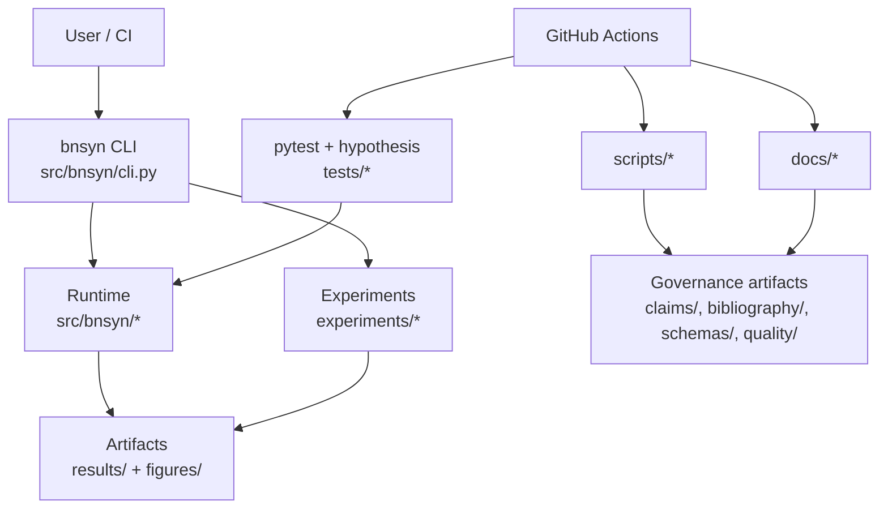

# BN-Syn Thermostated Bio-AI System

Deterministic reference implementation for phase-controlled emergent dynamics, including simulation runtime, reproducible experiments, and SSOT governance artifacts in one repository.

[](https://github.com/neuron7x/bnsyn-phase-controlled-emergent-dynamics/actions/workflows/ci-pr.yml)
[](https://github.com/neuron7x/bnsyn-phase-controlled-emergent-dynamics/actions/workflows/ci-pr-atomic.yml)
[](https://github.com/neuron7x/bnsyn-phase-controlled-emergent-dynamics/actions/workflows/ci-validation.yml)
[](https://github.com/neuron7x/bnsyn-phase-controlled-emergent-dynamics/actions/workflows/docs.yml)
[](https://github.com/neuron7x/bnsyn-phase-controlled-emergent-dynamics/actions/workflows/codeql.yml)
[](LICENSE)

## Hero

BN-Syn models phase-controlled neural dynamics with deterministic execution and reproducibility-first validation. The repository combines:

- runtime implementation (`src/bnsyn/`),
- experiment orchestration (`experiments/`),
- governed evidence/claims (`claims/`, `bibliography/`, `schemas/`), and
- CI-enforced quality gates (`Makefile`, `.github/workflows/`).


## Proof of health

Canonical local verification path:

```bash
make quickstart-smoke
make test
make check
make docs
```

These map directly to repository CI expectations documented in [`docs/CI_GATES.md`](docs/CI_GATES.md).

## Canonical start

If you are new to the codebase, follow this order:

1. [`docs/START_HERE.md`](docs/START_HERE.md)
2. [`docs/QUICKSTART.md`](docs/QUICKSTART.md)
3. [`docs/ARCHITECTURE.md`](docs/ARCHITECTURE.md)
4. [`docs/CI_GATES.md`](docs/CI_GATES.md)
5. [`docs/GOVERNANCE.md`](docs/GOVERNANCE.md)

## Quickstart

```bash
python -m pip install -e .
python -m bnsyn --help
bnsyn demo --steps 120 --dt-ms 0.1 --seed 123 --N 32
```

Determinism smoke gate:

```bash
python -m pytest tests/test_determinism.py tests/test_properties_determinism.py -q
```

## Architecture



## Flagship result (repo artifact backed)

Flagship run: `temp_ablation_v2` (`results/temp_ablation_v2/*.json`).

| Condition | Seeds | Final `w_total` variance | Final `w_cons` variance | `tag_activity_mean` | `w_total_reduction_pct` vs `fixed_high` |
|---|---:|---:|---:|---:|---:|
| cooling_piecewise | 20 | 0.010301505996 | 0.003038830572 | 0.651723 | 18.774067 |
| fixed_high | 20 | 0.012682533311 | 0.003600061306 | 0.654624 | 0.000000 |
| fixed_low | 20 | 0.000000150310 | 0.000000000000 | 0.000000 | 99.998815 |
| random_T | 20 | 0.016431453430 | 0.004456207875 | 0.636723 | -29.559710 |

Reproduce and verify:

```bash
python -m experiments.runner temp_ablation_v2
python -m scripts.visualize_experiment --run-id temp_ablation_v2
python -m experiments.verify_hypothesis docs/HYPOTHESIS.md results/temp_ablation_v2
```

## Governance

Repository SSOT and evidence controls:

- [`docs/SSOT.md`](docs/SSOT.md)
- [`docs/EVIDENCE_COVERAGE.md`](docs/EVIDENCE_COVERAGE.md)
- [`README_CLAIMS_GATE.md`](README_CLAIMS_GATE.md)
- [`scripts/validate_claims.py`](scripts/validate_claims.py)
- [`scripts/validate_bibliography.py`](scripts/validate_bibliography.py)

## Quality gates

```bash
make test
make check
python -m build
make docs
```

Additional references:

- Testing strategy: [`docs/TESTING.md`](docs/TESTING.md)
- CI gate matrix: [`docs/CI_GATES.md`](docs/CI_GATES.md)
- Project status: [`docs/STATUS.md`](docs/STATUS.md)
- Contributing: [`CONTRIBUTING.md`](CONTRIBUTING.md)
- Security policy: [`SECURITY.md`](SECURITY.md)
