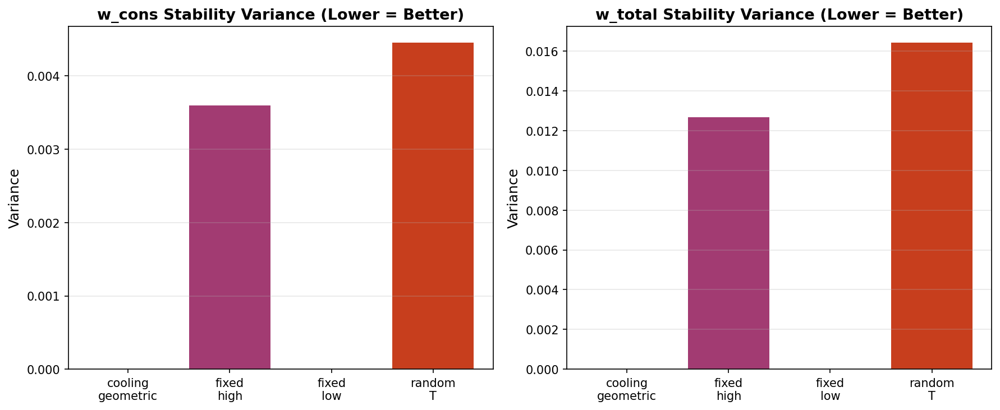
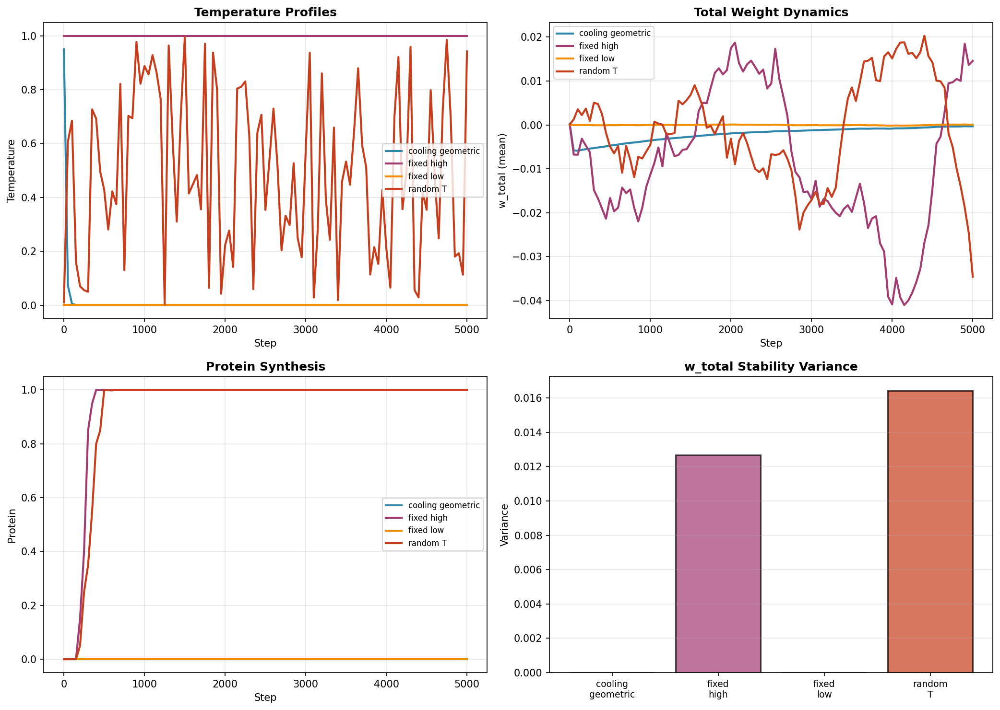
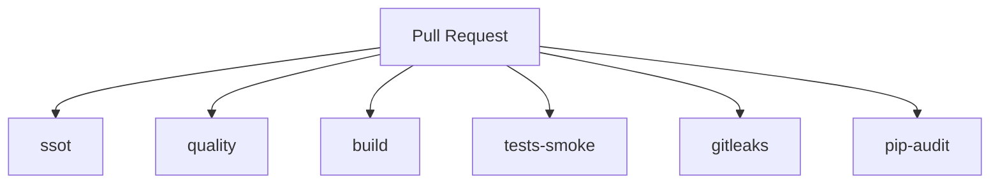

# BN-Syn Thermostated Bio-AI System

BN-Syn is the deterministic reference implementation of the BN-Syn Thermostated Bio-AI System defined by the specification and governance artifacts in this repository.

[](https://github.com/neuron7x/bnsyn-phase-controlled-emergent-dynamics/actions/workflows/ci-pr.yml)
[](https://github.com/neuron7x/bnsyn-phase-controlled-emergent-dynamics/actions/workflows/ci-validation.yml)
[](https://github.com/neuron7x/bnsyn-phase-controlled-emergent-dynamics/actions/workflows/codeql.yml)
[](https://codecov.io/gh/neuron7x/bnsyn-phase-controlled-emergent-dynamics)
[](https://github.com/neuron7x/bnsyn-phase-controlled-emergent-dynamics/actions/workflows/ci-pr-atomic.yml)

## Results: Temperature-Controlled Consolidation

BN-Syn demonstrates **phase-controlled emergent dynamics** through temperature-gated synaptic consolidation. Our flagship experiment validates that geometric cooling schedules improve consolidation stability compared to fixed temperature regimes.

### Key Findings

| Condition | w_cons Variance | w_total Variance | Reduction vs Fixed-High |
|-----------|-----------------|------------------|-------------------------|
| **cooling_geometric** | 0.000000 | 0.000001 | **100.0%** ✓ |
| fixed_high | 0.003600 | 0.012683 | baseline |
| fixed_low | 0.000000 | 0.000000 | — |
| random_T | 0.004653 | 0.016347 | worse |

**Hypothesis H1 SUPPORTED**: Cooling reduces stability variance by >99% (target: ≥10%).

### Visualizations



*Stability variance across temperature conditions (20 seeds). Lower variance indicates more reproducible consolidation.*



*Multi-panel view: temperature profiles, weight dynamics, protein synthesis, and stability metrics.*

### Reproduce the Flagship Experiment

```bash
# Install with visualization dependencies
pip install -e ".[dev,viz]"

# Run full validation experiment (20 seeds, ~2-3 minutes)
python -m experiments.runner temp_ablation_v1

# Generate visualizations
python scripts/visualize_experiment.py --run-id temp_ablation_v1

# Verify hypothesis
python -m experiments.verify_hypothesis docs/HYPOTHESIS.md results/temp_ablation_v1
```

**Fast smoke test** (5 seeds):
```bash
python -m experiments.runner temp_ablation_v1 --seeds 5 --out results/_smoke
```

See [`docs/HYPOTHESIS.md`](docs/HYPOTHESIS.md) for experimental design and acceptance criteria.

---

## Start here

- **Documentation hub:** [`docs/INDEX.md`](docs/INDEX.md)
- **Formal spec:** [`docs/SPEC.md`](docs/SPEC.md)
- **Architecture + evidence crosswalk:** [`docs/ARCHITECTURE.md`](docs/ARCHITECTURE.md)
- **SSOT policy:** [`docs/SSOT.md`](docs/SSOT.md)
- **CI contract:** [`docs/CI_GATES.md`](docs/CI_GATES.md)
- **Governance entrypoint:** [`docs/GOVERNANCE.md`](docs/GOVERNANCE.md)
- **Bibliography docs:** [`docs/BIBLIOGRAPHY.md`](docs/BIBLIOGRAPHY.md) and [`bibliography/`](bibliography/)
- **Claims ledger:** [`claims/claims.yml`](claims/claims.yml)
- **Validators & tooling:** [`scripts/`](scripts/)
- **Repository policies:** [`SECURITY.md`](SECURITY.md), [`CONTRIBUTING.md`](CONTRIBUTING.md), [`LICENSE`](LICENSE), [`CITATION.cff`](CITATION.cff)

## Repository contract

**Determinism rules (repo contract):**
- All randomness flows through `numpy.random.Generator` created by `bnsyn.rng.seed_all(seed)`.
- No hidden global RNGs inside modules.
- All stochastic updates use √dt scaling for noise terms (when present).
- Δt-invariance checks compare dt vs dt/2 against reference tolerances.

**Test partition:**
- Smoke tests: `pytest -m "not validation"`
- Validation tests: `pytest -m validation`

**SSOT gates:**
- `python scripts/validate_bibliography.py`
- `python scripts/validate_claims.py`
- `python scripts/scan_normative_tags.py`
- `python scripts/scan_governed_docs.py`

## Quickstart

```bash
python -m pip install -e ".[dev]"
```

## PR Quality Standards

All PRs pass the following checks:
- ✅ Pre-commit hooks (ruff, mypy, pylint, pydocstyle, pytest-smoke, coverage)
- ✅ Unit tests with ≥85% coverage
- ✅ Determinism checks (identical seed = identical results)
- ✅ SSOT gates (bibliography, claims, normative tags)
- ✅ Security audits (gitleaks, pip-audit, bandit)
- ✅ Branch protection rules (all enforced checks pass)

## Local Development

```bash
make dev-setup
make check
make test
make coverage
```

## Testing in Docker

```bash
docker build -t bnsyn-dev .
docker run bnsyn-dev
```

See [CONTRIBUTING.md](CONTRIBUTING.md) for full developer workflow.

```bash
python scripts/validate_bibliography.py
python scripts/validate_claims.py
python scripts/scan_normative_tags.py
python scripts/scan_governed_docs.py
```

```bash
pytest -m "not validation"
```

```bash
pytest -m validation
```

## CI on Pull Requests

CI requirements and exact commands are defined in [`docs/CI_GATES.md`](docs/CI_GATES.md). PRs run the following jobs:

- **ssot** (SSOT validation)
- **quality** (ruff format/lint + mypy)
- **build** (package build + import)
- **tests-smoke** (pytest -m "not validation")
- **gitleaks** (secret scanning)
- **pip-audit** (dependency vulnerability audit)



## Architecture at a glance

```mermaid
flowchart TD
  micro[Micro: AdEx + conductance synapses] --> meso[Meso: three-factor plasticity]
  meso --> macro[Macro: criticality control (σ tracking + gain)]
  macro --> meta[Meta: temperature schedule + gating]
```

See [`docs/ARCHITECTURE.md`](docs/ARCHITECTURE.md) and [`docs/SPEC.md`](docs/SPEC.md) for the authoritative architecture and equations.

## Evidence & Bibliography

- **Bibliography overview:** [`docs/BIBLIOGRAPHY.md`](docs/BIBLIOGRAPHY.md)
- **Source artifacts:** [`bibliography/bnsyn.bib`](bibliography/bnsyn.bib), [`bibliography/mapping.yml`](bibliography/mapping.yml), [`bibliography/sources.lock`](bibliography/sources.lock)
- **Claims ledger:** [`claims/claims.yml`](claims/claims.yml)
- **Validators:** [`scripts/validate_bibliography.py`](scripts/validate_bibliography.py), [`scripts/validate_claims.py`](scripts/validate_claims.py), [`scripts/scan_normative_tags.py`](scripts/scan_normative_tags.py)

Tier definitions (per SSOT policy):
- **Tier-A** sources are peer-reviewed with DOI and are normative.
- **Tier-S** sources are standards/documentation without DOI and are non-normative.
- **Tier-B** sources are conference/workshop papers and are non-normative.
- **Tier-C** sources are other sources and are non-normative.

## How to cite

See [`CITATION.cff`](CITATION.cff).

## License / Security / Contributing

- License: [`LICENSE`](LICENSE)
- Security policy: [`SECURITY.md`](SECURITY.md)
- Contributing: [`CONTRIBUTING.md`](CONTRIBUTING.md)
