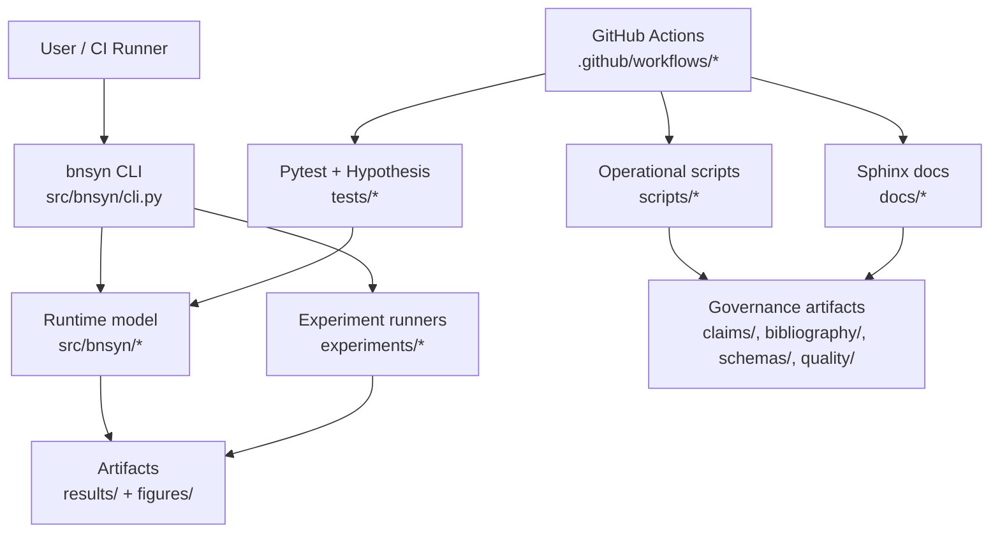

<p align="center">
  
</p>

<p align="center">
  
</p>

## Proof of Health

[](https://github.com/neuron7x/bnsyn-phase-controlled-emergent-dynamics/actions/workflows/ci-pr.yml)
[](https://github.com/neuron7x/bnsyn-phase-controlled-emergent-dynamics/actions/workflows/ci-pr-atomic.yml)
[](https://github.com/neuron7x/bnsyn-phase-controlled-emergent-dynamics/actions/workflows/ci-validation.yml)
[](https://github.com/neuron7x/bnsyn-phase-controlled-emergent-dynamics/actions/workflows/codeql.yml)
[](https://github.com/neuron7x/bnsyn-phase-controlled-emergent-dynamics/actions/workflows/docs.yml)
[](LICENSE)

BN-Syn is the deterministic reference implementation of the BN-Syn Thermostated Bio-AI System. The repository contains the runtime simulator, experiments, validation harnesses, and governance tooling used to keep claims traceable to evidence.

## Stack / Tech Radar

- **Language/runtime:** Python 3.11+ (`pyproject.toml`)
- **Core scientific libs:** NumPy, SciPy, Pydantic, JSON Schema validation
- **Quality toolchain:** pytest (+ markers), Hypothesis, Ruff, Pylint, Mypy, Bandit, pip-audit
- **Docs pipeline:** Sphinx + MyST + Furo
- **Interfaces:** package CLI (`bnsyn`), Python modules under `src/bnsyn`, operational scripts under `scripts/`
- **Delivery surfaces:** Dockerfile, docker-compose, GitHub Actions workflows

## Architecture (repo-aligned)



## Why this repo is different

- **Determinism-first workflow:** seeded execution and dedicated determinism tests are part of the standard suite.
- **Evidence-governed science:** claims, bibliography, schemas, and validation scripts are versioned in the same codebase.
- **Tiered CI strategy:** PR-blocking smoke gates plus scheduled validation/property/benchmark workflows.
- **Single-repo operability:** runtime, experiments, quality gates, and documentation build from one install.

## Quickstart (≈60s)

```bash
python -m pip install -e .
python -m pip install -e ".[dev,test]"
python -m bnsyn --help
bnsyn --help
bnsyn demo --steps 120 --dt-ms 0.1 --seed 123 --N 32
python -m pytest -m "not validation" -q
make lint
make mypy
python -m build
```

## Canonical maps

- Repository map: [`docs/repo_map.md`](docs/repo_map.md)
- Usage workflows: [`docs/usage_workflows.md`](docs/usage_workflows.md)
- Testing and gate policy: [`docs/TESTING.md`](docs/TESTING.md), [`docs/CI_GATES.md`](docs/CI_GATES.md)
- Architecture and spec crosswalk: [`docs/ARCHITECTURE.md`](docs/ARCHITECTURE.md), [`docs/spec_to_code.yml`](docs/spec_to_code.yml)

<details>
<summary><strong>Design Principles</strong></summary>

- Specification is authoritative for behavior; architecture/docs are traceability layers.
- Deterministic execution and reproducibility metadata are baseline requirements.
- Claims are only accepted when backed by tracked evidence artifacts.
- Quality gates run locally and in CI via documented Make targets.

</details>

<details>
<summary><strong>Operations</strong></summary>

- Setup: `make dev-setup`
- Smoke test path: `make test`
- Full quality path: `make quality` (format/lint/mypy/ssot/security)
- Coverage workflow: `make coverage` then `make coverage-gate`
- Docs build: `make docs`
- Release readiness: `make release-readiness`

</details>

<details>
<summary><strong>Threat Model / Security</strong></summary>

- License and governance: [`LICENSE`](LICENSE), [`docs/GOVERNANCE.md`](docs/GOVERNANCE.md)
- Secure checks wired in Make/CI: gitleaks, pip-audit, bandit
- Code scanning workflow: [`.github/workflows/codeql.yml`](.github/workflows/codeql.yml)
- Dependency review workflow: [`.github/workflows/dependency-review.yml`](.github/workflows/dependency-review.yml)

</details>

<details>
<summary><strong>Contributing & FAQ</strong></summary>

- Contribution guide: [`CONTRIBUTING.md`](CONTRIBUTING.md)
- Project status: [`docs/STATUS.md`](docs/STATUS.md)
- FAQ:
  - **Is this production software?** → No, repository status is research-grade / pre-production.
  - **Where are normative claims tracked?** → `claims/claims.yml` with bibliography under `bibliography/`.
  - **Where do I start reading code?** → `src/bnsyn/cli.py` and `docs/repo_map.md`.

</details>

---

<p align="center"><sub>BN-Syn • Deterministic research runtime • MIT licensed</sub></p>
