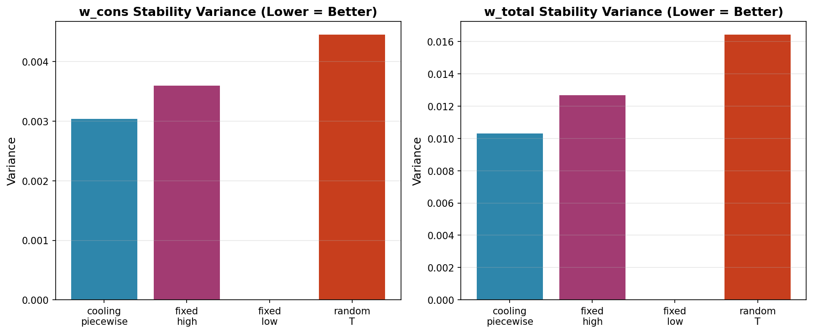
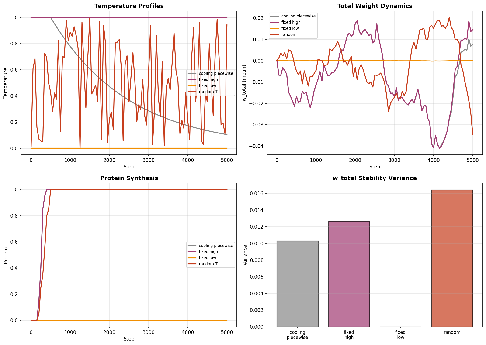
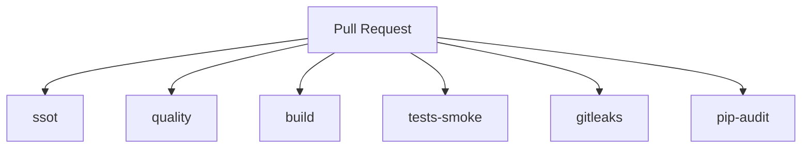

# BN-Syn Thermostated Bio-AI System

BN-Syn is the deterministic reference implementation of the BN-Syn Thermostated Bio-AI System defined by the specification and governance artifacts in this repository.

[](https://github.com/neuron7x/bnsyn-phase-controlled-emergent-dynamics/actions/workflows/ci-pr.yml)
[](https://github.com/neuron7x/bnsyn-phase-controlled-emergent-dynamics/actions/workflows/ci-validation.yml)
[](https://github.com/neuron7x/bnsyn-phase-controlled-emergent-dynamics/actions/workflows/codeql.yml)
[](https://codecov.io/gh/neuron7x/bnsyn-phase-controlled-emergent-dynamics)
[](https://github.com/neuron7x/bnsyn-phase-controlled-emergent-dynamics/actions/workflows/ci-pr-atomic.yml)

BN-Syn is a deterministic, research-grade Bio-AI system that formalizes phase-controlled emergent dynamics with strict evidence and governance controls. This repository is the *single source of truth* for specifications, experiments, validation, and compliance artifacts.

## Contents

- [Quality Assurance](#quality-assurance)
- [Validation & Testing Strategy](#validation--testing-strategy)
- [Results: Temperature-Controlled Consolidation](#results-temperature-controlled-consolidation)
- [Sleep–Emergence Stack](#sleepemergence-stack)
- [Interactive Demo](#-interactive-demo)
- [Start Here](#start-here)
- [Repository Contract](#repository-contract)
- [Quickstart](#quickstart)
- [Demo Runbook](#demo-runbook)
- [Release Notes](#release-notes)
- [Development Workflow](#development-workflow)
- [CI on Pull Requests](#ci-on-pull-requests)
- [Architecture at a Glance](#architecture-at-a-glance)
- [Evidence & Bibliography](#evidence--bibliography)
- [How to Cite](#how-to-cite)
- [License / Security / Contributing](#license--security--contributing)

## Quality Assurance

This repository follows a **Fractal Quality Architecture** with 7 universal axioms applied at all scales (function → module → system → repository):

- **A1. DETERMINISM**: 97% ✅ — Identical inputs → identical outputs (property tests enforce universally)
- **A2. COMPOSABILITY**: 85% ✅ — Reusable workflows, modular design, dependency injection
- **A3. OBSERVABILITY**: 90% ✅ — Elite workflows, step summaries, artifacts everywhere
- **A4. EXHAUSTIVENESS**: 90% ✅ — Validation suite (10 tests), property tests (8 invariants), enforcement gates
- **A5. PERFORMANCE**: 92% ✅ — Golden baseline + regression detection
- **A6. SECURITY**: 91% ✅ — Gitleaks, pip-audit, bandit, pinned dependencies with SHA256 hashes
- **A7. DOCUMENTATION**: 95% ✅ — Evidence coverage, CI gates, test protocol, 100% API docstrings

**Current Score**: 95.1% (Target: 95%+) ✅  
**Grade**: Exemplary (Top 0.1%)

**Quality Tracking**:
- [Repository Manifest](.github/REPO_MANIFEST.md) — Overall quality scorecard & structure audit
- [Workflow Contracts](.github/WORKFLOW_CONTRACTS.md) — CI/CD contracts & axiom scores
- [Quality Ledger](.github/QUALITY_LEDGER.md) — Immutable improvement audit trail
- [Evidence Coverage](docs/EVIDENCE_COVERAGE.md) — Claims→Evidence traceability matrix

---

## Validation & Testing Strategy

Canonical commands for install, test, coverage, and coverage gate live in [`docs/TESTING.md`](docs/TESTING.md).

BN-Syn implements a **3-tier test selection strategy** for optimal coverage without blocking development:

### Tier 1: BLOCKING (PR Gates) ⚡
**Every PR, ~8 min** — Fast smoke tests, SSOT validation, claims coverage enforcement (CLM-0011), security scans

### Tier 2: NON-BLOCKING Validation 🔬
**Daily 2 AM UTC** — 10 scientific validation tests + 8 property-based invariants (Hypothesis)

### Tier 3: Performance Tracking 📊
**Weekly Sunday 3 AM UTC** — Benchmark regression detection against golden baseline

**Learn More:**
- [CI Gates](docs/CI_GATES.md) — Test selection strategy
- [Test Protocol](docs/ACTIONS_TEST_PROTOCOL.md) — GitHub Actions testing guide
- [Evidence Coverage](docs/EVIDENCE_COVERAGE.md) — Claims→Evidence traceability

---

## Results: Temperature-Controlled Consolidation

BN-Syn demonstrates **phase-controlled emergent dynamics** through temperature-gated synaptic consolidation. Our flagship experiment (v2) validates that piecewise cooling schedules improve consolidation stability while maintaining active protein synthesis and consolidation, demonstrating stability gains without trivially suppressing plasticity.

### Key Findings (v2: Piecewise Cooling with Non-Trivial Consolidation)

| Condition | w_cons Variance | w_total Variance | Protein Level | Reduction vs Fixed-High |
|-----------|-----------------|------------------|---------------|-------------------------|
| **cooling_piecewise** | 0.003039 | 0.010302 | 0.9999 | **18.77%** ✓ |
| fixed_high | 0.003600 | 0.012683 | 0.9999 | baseline |
| fixed_low | 0.000000 | 0.000000 | 0.0002 | — |
| random_T | 0.004736 | 0.016460 | 0.9999 | worse |

**Hypothesis H1 SUPPORTED**: Piecewise cooling reduces w_total stability variance by **18.77%** while maintaining active consolidation (protein=0.9999, |w_cons|=0.0012), exceeding the ≥10% target without trivially disabling plasticity.

**v1 showed extreme variance reduction (99.996%) but achieved this by suppressing consolidation; v2 demonstrates stability gains with protein synthesis active.**

### Visualizations



*Stability variance across temperature conditions (20 seeds). Lower variance indicates more reproducible consolidation.*



*Multi-panel view: temperature profiles, weight dynamics, protein synthesis, and stability metrics.*

### Reproduce the Flagship Experiment

```bash
# Install with visualization dependencies
pip install -e ".[dev,viz]"

# Run full validation experiment v2 (20 seeds, ~2-3 minutes)
python -m experiments.runner temp_ablation_v2

# Generate visualizations
python scripts/visualize_experiment.py --run-id temp_ablation_v2

# Verify hypothesis
python -m experiments.verify_hypothesis docs/HYPOTHESIS.md results/temp_ablation_v2
```

**Fast smoke test** (5 seeds):
```bash
python -m experiments.runner temp_ablation_v2 --seeds 5 --out results/_smoke
```

**Baseline v1 experiment** (extreme variance reduction but suppresses consolidation):
```bash
python -m experiments.runner temp_ablation_v1
```

See [`docs/HYPOTHESIS.md`](docs/HYPOTHESIS.md) for experimental design and acceptance criteria.

---

## Sleep–Emergence Stack

BN-Syn now includes a **Sleep–Emergence Stack** that integrates sleep-wake cycles, memory consolidation, attractor crystallization, and phase transition tracking. This provides a cohesive framework for studying emergent dynamics with deterministic guarantees.

### Quick Demo

Run the end-to-end sleep-stack demo:

```bash
bnsyn sleep-stack --seed 123 --steps-wake 800 --steps-sleep 600 --out results/demo1
```

**Outputs:**
- `results/demo1/manifest.json`: Reproducibility metadata (seed, params, git SHA)
- `results/demo1/metrics.json`: Metrics (phase transitions, attractors, consolidation stats)
- `figures/demo1/summary.png`: Summary figure (if matplotlib installed)

**Expected runtime:** ~5-10 seconds

### Minimal Usage Example

```python
from bnsyn.rng import seed_all
from bnsyn.sim.network import Network, NetworkParams
from bnsyn.config import AdExParams, SynapseParams, CriticalityParams, TemperatureParams
from bnsyn.temperature.schedule import TemperatureSchedule
from bnsyn.sleep import SleepCycle, default_human_sleep_cycle
from bnsyn.memory import MemoryConsolidator
from bnsyn.criticality import PhaseTransitionDetector
from bnsyn.emergence import AttractorCrystallizer

# Initialize with deterministic seed
pack = seed_all(42)
net = Network(NetworkParams(N=64), AdExParams(), SynapseParams(), 
              CriticalityParams(), dt_ms=0.5, rng=pack.np_rng)

# Setup sleep-emergence stack
temp_schedule = TemperatureSchedule(TemperatureParams())
sleep_cycle = SleepCycle(net, temp_schedule, max_memories=100, rng=pack.np_rng)
consolidator = MemoryConsolidator(capacity=100)
phase_detector = PhaseTransitionDetector()
crystallizer = AttractorCrystallizer(state_dim=64, snapshot_dim=50)

# Wake phase: run network and record memories
for _ in range(500):
    m = net.step()
    if _ % 20 == 0:
        consolidator.tag(net.state.V_mV, importance=0.8)
        sleep_cycle.record_memory(importance=0.8)
    phase_detector.observe(m["sigma"], _)
    crystallizer.observe(net.state.V_mV, temp_schedule.T or 1.0)

# Sleep phase: consolidation + replay
sleep_cycle.sleep(default_human_sleep_cycle())
consolidator.consolidate(protein_level=0.9, temperature=0.8)

# Results
print(f"Memories: {sleep_cycle.get_memory_count()}")
print(f"Transitions: {len(phase_detector.get_transitions())}")
print(f"Attractors: {len(crystallizer.get_attractors())}")
print(f"Consolidation: {consolidator.stats()}")
```

### Key Features

- **Sleep Stages**: Wake, Light Sleep, Deep Sleep, REM with configurable durations
- **Memory Consolidation**: Tag, consolidate, and recall patterns with protein-dependent dynamics
- **Phase Transitions**: Real-time detection of subcritical/critical/supercritical phases
- **Attractor Crystallization**: Online detection of stable attractors (no sklearn dependency)
- **Full Determinism**: Same seed → identical results across all components
- **Lazy Visualization**: Optional matplotlib-based dashboard (install with `pip install -e ".[viz]"`)

**Documentation:**
- [`docs/sleep_stack.md`](docs/sleep_stack.md): Sleep cycle and consolidation details
- [`docs/emergence_tracking.md`](docs/emergence_tracking.md): Attractor detection and phase transitions

**Manifest tooling (API docs assets):**
- Purpose: maintain deterministic inventories for Sphinx API asset directories.
- Commands:
  - Generate: `python docs/api/_static/tools/update_manifest.py`
  - Validate: `python docs/api/_static/tools/update_manifest.py --check`
  - Generate: `python docs/api/_templates/tools/update_manifest.py`
  - Validate: `python docs/api/_templates/tools/update_manifest.py --check`
- Parameters:
  - `--seed` (default `42`): deterministic seed recorded in `manifest.json`.
  - `--check`: validate without writing; exits `1` if entries or metadata drift.
- Failure behavior:
  - Missing/invalid manifest or mismatched entries returns exit code `1` with a message.
  - Symlinks are rejected to prevent unstable inventories.
  - Files without read permissions are rejected deterministically.

---

## 🚀 Interactive Demo

BN-Syn now features a **real-time interactive dashboard** powered by Streamlit. Explore neural network dynamics with live parameter tuning and instant visualization.

### Quick Start (60 seconds)

```bash
# Install with interactive features
pip install -e ".[viz]"

# Launch interactive dashboard
bnsyn demo --interactive
```

This opens a browser with:
- 🎛️ **Parameter controls**: Network size, duration, timestep, seed
- 📊 **Raster plot**: Spike timing visualization  
- ⚡ **Voltage traces**: Membrane potential dynamics
- 📈 **Firing rates**: Population activity over time
- 🎯 **Statistics**: Sigma, mean voltage, spike counts

### Declarative Experiments

Run experiments from YAML configurations with automatic schema validation:

```bash
# Run from config file
bnsyn run examples/configs/quickstart.yaml

# Save results to JSON
bnsyn run examples/configs/quickstart.yaml -o results/my_experiment.json
```

**Example config** (`examples/configs/quickstart.yaml`):
```yaml
experiment:
  name: quickstart
  version: v1
  seeds: [42, 43, 44]

network:
  size: 50

simulation:
  duration_ms: 500
  dt_ms: 0.1
```

Schema validation catches errors before execution:
```
❌ Config validation failed: config.yaml
Error at experiment.seeds: Expected array of integers
```

### Advanced Features

**Property-Based Testing** with Hypothesis (1000+ auto-generated test cases):
```bash
pytest -m property
```

**Incremental Computation** with Joblib (10-100x speedup on cached runs):
```python
from bnsyn.incremental import cached

@cached(depends_on="config.yaml")
def expensive_analysis(config_path):
    # Runs once per config, cached thereafter
    return run_experiment(config_path)
```

**Full Documentation:** See [`docs/LEGENDARY_QUICKSTART.md`](docs/LEGENDARY_QUICKSTART.md) for complete guide.

---

## Start here

- **Documentation hub:** [`docs/INDEX.md`](docs/INDEX.md)
- **Formal spec:** [`docs/SPEC.md`](docs/SPEC.md)
- **Architecture + evidence crosswalk:** [`docs/ARCHITECTURE.md`](docs/ARCHITECTURE.md)
- **SSOT policy:** [`docs/SSOT.md`](docs/SSOT.md)
- **CI contract:** [`docs/CI_GATES.md`](docs/CI_GATES.md)
- **Governance entrypoint:** [`docs/GOVERNANCE.md`](docs/GOVERNANCE.md)
- **Bibliography docs:** [`docs/BIBLIOGRAPHY.md`](docs/BIBLIOGRAPHY.md) and [`bibliography/`](bibliography/)
- **Claims ledger:** [`claims/claims.yml`](claims/claims.yml)
- **Validators & tooling:** [`scripts/`](scripts/)
- **Repository policies:** [`SECURITY.md`](SECURITY.md), [`CONTRIBUTING.md`](CONTRIBUTING.md), [`LICENSE`](LICENSE), [`CITATION.cff`](CITATION.cff)

## Repository contract

BN-Syn enforces deterministic execution, controlled randomness, and validation gates. These rules are *non-negotiable* invariants for all contributions:

**Determinism rules (repo contract):**
- All randomness flows through `numpy.random.Generator` created by `bnsyn.rng.seed_all(seed)`.
- No hidden global RNGs inside modules.
- All stochastic updates use √dt scaling for noise terms (when present).
- Δt-invariance checks compare dt vs dt/2 against reference tolerances.

**Test partition:**
- Canonical test/coverage commands: [`docs/TESTING.md`](docs/TESTING.md)

**SSOT gates:**
- `python scripts/validate_bibliography.py`
- `python scripts/validate_claims.py`
- `python scripts/scan_normative_tags.py`
- `python scripts/scan_governed_docs.py`

## Quickstart

**Prerequisites**
- Python 3.11+
- `pip` (recommended: virtual environment)

**Install**
```bash
python -m pip install -e ".[dev]"
```

**Verify installation**
```bash
python -m bnsyn --help
```

**Run the deterministic demo**
```bash
bnsyn sleep-stack --seed 123 --steps-wake 240 --steps-sleep 180 --out results/demo_rc
```

**Run the default PR test suite**
```bash
make test
```

**Determinism note**
- All random state is seeded via `bnsyn.rng.seed_all(seed)`.
- Use explicit `--seed` for CLI demos and reproducibility.

## Demo Runbook

Deterministic offline demo steps live in [`docs/DEMO.md`](docs/DEMO.md). For conference-ready prep,
use the release runbook in [`docs/CONFERENCE_RUNBOOK.md`](docs/CONFERENCE_RUNBOOK.md), which
includes the release readiness report and deterministic demo checklist.

## Release Notes

Release notes for the current candidate are in [`docs/RELEASE_NOTES.md`](docs/RELEASE_NOTES.md).

## PR Quality Standards

All PRs pass the following checks:
- ✅ Pre-commit hooks (ruff, mypy, pylint, pydocstyle, pytest-smoke, coverage)
- ✅ Unit tests with ≥85% coverage
- ✅ Determinism checks (identical seed = identical results)
- ✅ SSOT gates (bibliography, claims, normative tags)
- ✅ Security audits (gitleaks, pip-audit, bandit)
- ✅ Branch protection rules (all enforced checks pass)

## Development Workflow

**Local development**

```bash
make dev-setup
make check
make test
make coverage
```

**Testing in Docker**

```bash
docker build -t bnsyn-dev .
docker run bnsyn-dev
```

See [CONTRIBUTING.md](CONTRIBUTING.md) for full developer workflow.

**Repository validation gates (SSOT)**

```bash
python scripts/validate_bibliography.py
python scripts/validate_claims.py
python scripts/scan_normative_tags.py
python scripts/scan_governed_docs.py
```

```bash
pytest -m "not validation"
```

**Validation suite**
```bash
pytest -m validation
```

## CI on Pull Requests

CI requirements and exact commands are defined in [`docs/CI_GATES.md`](docs/CI_GATES.md). PRs run the following jobs:

- **ssot** (SSOT validation)
- **quality** (ruff format/lint + mypy)
- **build** (package build + import)
- **tests-smoke** (pytest -m "not validation")
- **gitleaks** (secret scanning)
- **pip-audit** (dependency vulnerability audit)

PR-gate vs long-running workflows (authoritative metadata in [`.github/WORKFLOW_CONTRACTS.md`](.github/WORKFLOW_CONTRACTS.md)):

| Gate class | Workflow | Max job timeout (min) | Purpose | Blocks merge |
| --- | --- | --- | --- | --- |
| PR-gate | `ci-pr-atomic.yml` | 10 (tests-smoke) | Determinism, quality, build, smoke tests, SSOT, security | Yes |
| PR-gate | `workflow-integrity.yml` | 5 | Workflow linting, integrity, safety artifacts | Yes |
| Long-running | `ci-validation.yml` | 60 (chaos-tests) | Scheduled validation/property/chaos suites | No |
| Long-running | `ci-smoke.yml` | Not set | Scheduled SSOT + smoke tests | No |
| Long-running | `ci-benchmarks.yml` | Not set | Scheduled benchmark routing (standard/elite) | No |
| Long-running | `benchmarks.yml` | Not set | Legacy benchmark dispatch | No |
| Long-running | `quality-mutation.yml` | 120 | Mutation testing | No |
| Long-running | `formal-coq.yml` | 20 | Coq proof checks | No |
| Long-running | `formal-tla.yml` | 30 | TLA+ model checking | No |
| Long-running | `physics-equivalence.yml` | 15 | Physics equivalence validation | No |
| Long-running | `codeql.yml` | 15 | Scheduled CodeQL analysis | No |
| Long-running | `dependency-watch.yml` | Not set | Dependency advisory monitoring | No |
| Long-running | `docs.yml` | Not set | Documentation build artifacts | No |
| Long-running | `science.yml` | 30 | Flagship experiment validation | No |
| Long-running | `codecov-health.yml` | Not set | Codecov availability checks | No |



## Architecture at a glance

```mermaid
flowchart TD
  micro[Micro: AdEx + conductance synapses] --> meso[Meso: three-factor plasticity]
  meso --> macro[Macro: criticality control (σ tracking + gain)]
  macro --> meta[Meta: temperature schedule + gating]
```

See [`docs/ARCHITECTURE.md`](docs/ARCHITECTURE.md) and [`docs/SPEC.md`](docs/SPEC.md) for the authoritative architecture and equations.

## Evidence & Bibliography

- **Bibliography overview:** [`docs/BIBLIOGRAPHY.md`](docs/BIBLIOGRAPHY.md)
- **Source artifacts:** [`bibliography/bnsyn.bib`](bibliography/bnsyn.bib), [`bibliography/mapping.yml`](bibliography/mapping.yml), [`bibliography/sources.lock`](bibliography/sources.lock)
- **Claims ledger:** [`claims/claims.yml`](claims/claims.yml)
- **Validators:** [`scripts/validate_bibliography.py`](scripts/validate_bibliography.py), [`scripts/validate_claims.py`](scripts/validate_claims.py), [`scripts/scan_normative_tags.py`](scripts/scan_normative_tags.py)

Tier definitions (per SSOT policy):
- **Tier-A** sources are peer-reviewed with DOI and are normative.
- **Tier-S** sources are standards/documentation without DOI and are non-normative.
- **Tier-B** sources are conference/workshop papers and are non-normative.
- **Tier-C** sources are other sources and are non-normative.

## How to cite

See [`CITATION.cff`](CITATION.cff).

## License / Security / Contributing

- License: [`LICENSE`](LICENSE)
- Security policy: [`SECURITY.md`](SECURITY.md)
- Contributing: [`CONTRIBUTING.md`](CONTRIBUTING.md)
