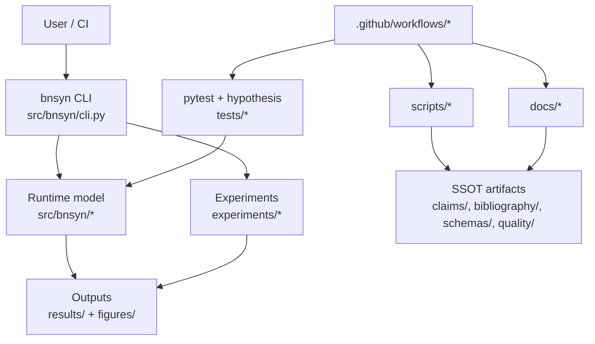

# BN-Syn Thermostated Bio-AI System

Deterministic reference implementation for phase-controlled emergent dynamics, with runtime simulation, reproducible experiments, and SSOT governance in one repository.

[](https://github.com/neuron7x/bnsyn-phase-controlled-emergent-dynamics/actions/workflows/ci-pr.yml)
[](https://github.com/neuron7x/bnsyn-phase-controlled-emergent-dynamics/actions/workflows/ci-pr-atomic.yml)
[](https://github.com/neuron7x/bnsyn-phase-controlled-emergent-dynamics/actions/workflows/ci-validation.yml)
[](https://github.com/neuron7x/bnsyn-phase-controlled-emergent-dynamics/actions/workflows/codeql.yml)
[](https://github.com/neuron7x/bnsyn-phase-controlled-emergent-dynamics/actions/workflows/docs.yml)
[](LICENSE)

## Start Here (Canonical Onboarding)

- Repo map: [`docs/repo_map.md`](docs/repo_map.md)
- Usage workflows: [`docs/usage_workflows.md`](docs/usage_workflows.md)
- Architecture/spec traceability: [`docs/ARCHITECTURE.md`](docs/ARCHITECTURE.md), [`docs/spec_to_code.yml`](docs/spec_to_code.yml)
- Testing and CI gates: [`docs/TESTING.md`](docs/TESTING.md), [`docs/CI_GATES.md`](docs/CI_GATES.md)
- SSOT policy and evidence coverage: [`docs/SSOT.md`](docs/SSOT.md), [`docs/EVIDENCE_COVERAGE.md`](docs/EVIDENCE_COVERAGE.md)
- Project status: [`docs/STATUS.md`](docs/STATUS.md)

## Quickstart (minimal, executable)

```bash
python -m pip install -e .
python -m bnsyn --help
bnsyn demo --steps 120 --dt-ms 0.1 --seed 123 --N 32
python -m pytest -m "not validation" -q
```

## Determinism & SSOT Gates

Determinism and claim-governance are first-class repository contracts.

```bash
python -m pytest tests/test_determinism.py tests/test_properties_determinism.py -q
python -m scripts.validate_bibliography
python -m scripts.validate_claims
python -m scripts.scan_normative_tags
python -m scripts.validate_claims_coverage --format markdown
```

## Flagship Reproducibility Path

**Flagship experiment (v2):**

```bash
python -m experiments.runner temp_ablation_v2
python -m scripts.visualize_experiment --run-id temp_ablation_v2
python -m experiments.verify_hypothesis docs/HYPOTHESIS.md results/temp_ablation_v2
```

**Fast smoke reproduction:**

```bash
python -m experiments.runner temp_ablation_v2 --seeds 5 --out results/_smoke
```

Artifacts are written under `results/` and `figures/`.

## CI / Validation Strategy (compressed)

- **Tier 1 (blocking PR gates):** smoke/unit path, SSOT checks, quality, security.
- **Tier 2 (scheduled, non-blocking):** validation/property/chaos suites.
- **Tier 3 (scheduled, non-blocking):** benchmark regression tracking.

Canonical details: [`docs/CI_GATES.md`](docs/CI_GATES.md).

## Stack / Tech Radar

- **Runtime:** Python 3.11+ (`pyproject.toml`)
- **Core libs:** NumPy, SciPy, Pydantic, jsonschema, joblib
- **Quality:** pytest, hypothesis, ruff, pylint, mypy, bandit, pip-audit
- **Docs:** Sphinx, MyST, Furo
- **Surfaces:** CLI (`bnsyn`), scripts (`scripts/`), Docker (`Dockerfile`, `docker-compose.yml`), GitHub Actions (`.github/workflows/`)

## Architecture (repo-aligned)



## Operations

```bash
make test
make lint
make mypy
python -m build
make docs
```

## Security / Contributing

- Security-related checks in local/CI flow: gitleaks, pip-audit, bandit (`Makefile`, CI workflows).
- Contribution process: [`CONTRIBUTING.md`](CONTRIBUTING.md)
- License: [`LICENSE`](LICENSE)

---

Research-grade / pre-production; no battle usage claimed without explicit external evidence artifacts.
