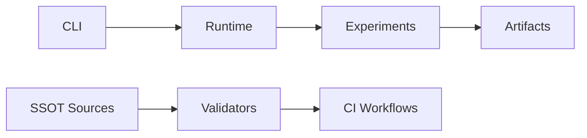

<div align="center">
  
</div>

# BN-Syn Thermostated Bio-AI System

BN-Syn is a deterministic research runtime for phase-controlled emergent dynamics with repository-native governance checks.
The repository combines simulation code in `src/bnsyn/` with SSOT validation scripts, schemas, claims, and CI gates.

[](https://github.com/neuron7x/bnsyn-phase-controlled-emergent-dynamics/actions/workflows/ci-pr.yml)
[](https://github.com/neuron7x/bnsyn-phase-controlled-emergent-dynamics/actions/workflows/ci-validation.yml)
[](https://github.com/neuron7x/bnsyn-phase-controlled-emergent-dynamics/actions/workflows/ci-pr-atomic.yml)
[](https://github.com/neuron7x/bnsyn-phase-controlled-emergent-dynamics/actions/workflows/docs.yml)
[](LICENSE)
[](pyproject.toml)

## What you can do here

- Run deterministic CLI simulations and demos (`bnsyn ...`) via `src/bnsyn/cli.py`.
- Execute baseline experiments from `experiments/` and inspect outputs in `results/` and `figures/`.
- Validate SSOT traceability and claim coverage using scripts in `scripts/`.
- Run repository quality gates with `make` targets aligned to CI workflows.

## Quickstart (≈60s)

```bash
make quickstart-smoke
```

```bash
python -m pip install -e .
python -m bnsyn --help
bnsyn demo --steps 120 --dt-ms 0.1 --seed 123 --N 32
python -m pytest -m "not validation" -q
```

## Architecture at a glance



### Key paths

- CLI: `src/bnsyn/cli.py`
- Runtime: `src/bnsyn/`
- Experiments: `experiments/`
- Artifacts: `results/`, `figures/`
- SSOT sources: `specs/`, `schemas/`, `claims/`, `docs/`
- Validators: `scripts/`
- CI workflows: `.github/workflows/`

## Status

This project is research-grade / pre-production. No battle usage claimed.

- Maturity: research-grade / pre-production
- Missing layers:
  - SRE runbooks under SLA
  - external integration contracts
  - stabilized public API/semver as product
  - perf budgets as “must”
  - support/release cadence as product

## Docs hub

- [Documentation index](docs/INDEX.md)
