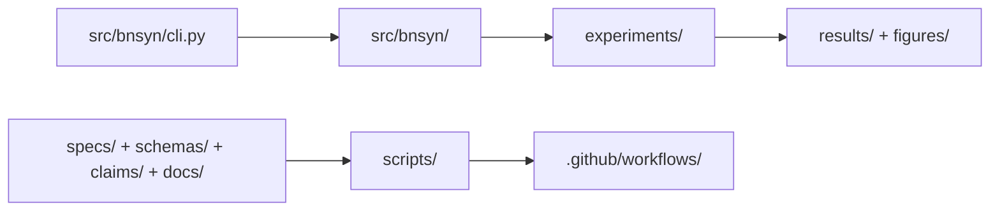

<div align="center">
  
</div>

# BN-Syn Thermostated Bio-AI System

BN-Syn is a repository for phase-controlled emergent dynamics simulations implemented in `src/bnsyn/` (see path/src/bnsyn).
The repository includes SSOT and governance assets under `specs/`, `schemas/`, `claims/`, `scripts/`, and `docs/` (see path/specs) (see path/schemas) (see path/claims) (see path/scripts) (see path/docs).

[](https://github.com/neuron7x/bnsyn-phase-controlled-emergent-dynamics/actions/workflows/ci-pr.yml)
[](https://github.com/neuron7x/bnsyn-phase-controlled-emergent-dynamics/actions/workflows/ci-validation.yml)
[](https://github.com/neuron7x/bnsyn-phase-controlled-emergent-dynamics/actions/workflows/ci-pr-atomic.yml)
[](https://github.com/neuron7x/bnsyn-phase-controlled-emergent-dynamics/actions/workflows/docs.yml)
[](LICENSE)
[](pyproject.toml)

## What’s in this repo

- CLI entrypoint: `src/bnsyn/cli.py` (see path/src/bnsyn/cli.py)
- Runtime package: `src/bnsyn/` (see path/src/bnsyn)
- Experiment inputs: `experiments/` (see path/experiments)
- Artifact outputs: `results/` and `figures/` (see path/results) (see path/figures)
- Validation scripts: `scripts/` (see path/scripts)
- CI workflows: `.github/workflows/` (see path/.github/workflows)

## Quickstart

```bash
make setup
make demo
make test
```

## Quickstart smoke verification (repo contract)

```bash
make quickstart-smoke
python -m pip install -e .
python -m bnsyn --help
bnsyn demo --steps 120 --dt-ms 0.1 --seed 123 --N 32
```

## Testing

Install test dependencies before running any pytest command:

```bash
python -m pip install -e ".[test]"
```

Canonical local suites:

```bash
make test-gate
make test-validation
make test-property
```

## Architecture at a glance



### Key Paths

- CLI: `src/bnsyn/cli.py` (see path/src/bnsyn/cli.py)
- Runtime: `src/bnsyn/` (see path/src/bnsyn)
- Experiments: `experiments/` (see path/experiments)
- Artifacts: `results/`, `figures/` (see path/results) (see path/figures)
- SSOT: `specs/`, `schemas/`, `claims/`, `docs/` (see path/specs) (see path/schemas) (see path/claims) (see path/docs)
- Validation: `scripts/` (see path/scripts)
- CI: `.github/workflows/` (see path/.github/workflows)

## Status

This project is research-grade / pre-production. No battle usage claimed.

- Maturity: research-grade / pre-production (see path/docs/STATUS.md)
- Missing layers:
  - SRE runbooks under SLA
  - external integration contracts
  - stabilized public API/semver as product
  - perf budgets as “must” [NORMATIVE][CLM-0011]
  - support/release cadence as product

## Docs hub

- [Documentation index](docs/INDEX.md) (see path/docs/INDEX.md)
