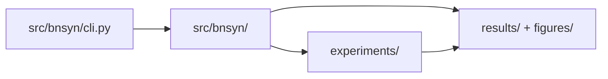
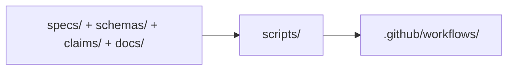

# Architecture

This page maps runtime and governance flows to repository paths (see path/docs/ARCHITECTURE.md).
Back to project landing page: [README.md](../README.md) (see path/README.md).

## Runtime execution flow

The CLI entrypoint is `src/bnsyn/cli.py` (see path/src/bnsyn/cli.py).
Runtime modules are under `src/bnsyn/` (see path/src/bnsyn).
Experiment definitions are under `experiments/` (see path/experiments).
Artifacts are written under `results/` and `figures/` (see path/results) (see path/figures).

## Governance and validation flow

SSOT sources are versioned under `specs/`, `schemas/`, `claims/`, and `docs/` (see path/specs) (see path/schemas) (see path/claims) (see path/docs).
Validation scripts run from `scripts/` (see path/scripts).
CI gates are defined in `.github/workflows/` (see path/.github/workflows).

## Key Paths

- Runtime entrypoint: `src/bnsyn/cli.py` (see path/src/bnsyn/cli.py)
- Runtime package: `src/bnsyn/` (see path/src/bnsyn)
- Experiment assets: `experiments/` (see path/experiments)
- Result artifacts: `results/` (see path/results)
- Figure artifacts: `figures/` (see path/figures)
- Validation scripts: `scripts/` (see path/scripts)
- CI workflows: `.github/workflows/` (see path/.github/workflows)
