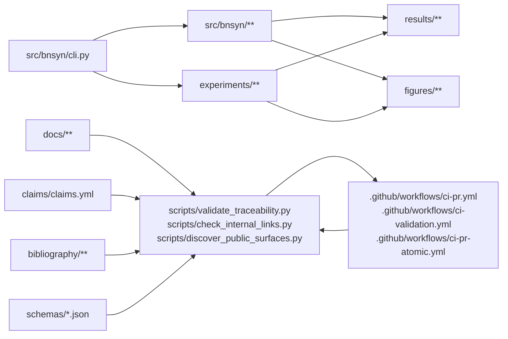
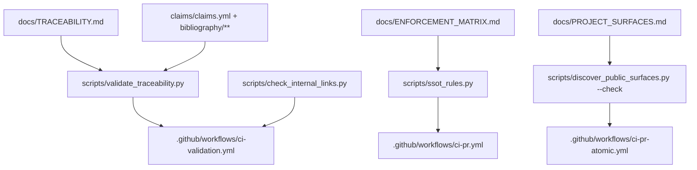

# Architecture (repo-aligned)

This page is a structural map of runnable surfaces and governance gates in this repository.
For public surfaces and SSOT enforcement details, see [PROJECT_SURFACES.md](PROJECT_SURFACES.md) and [ENFORCEMENT_MATRIX.md](ENFORCEMENT_MATRIX.md).

## Diagram A — System flow (CLI → runtime → experiments → artifacts → validators/CI)

## Diagram B — Governance / SSOT enforcement flow

## How to read these diagrams

- Nodes are concrete repo paths, never conceptual-only components.
- Solid arrows mean dependency or enforcement direction.
- `src/bnsyn/cli.py` is the documented command entry surface.
- `src/bnsyn/**` and `experiments/**` feed generated artifacts in `results/**` and `figures/**`.
- SSOT inputs are documentation, schemas, and claim/evidence files.
- Validators under `scripts/**` are the executable enforcement layer.
- CI workflows under `.github/workflows/**` are gate runners, not alternate policy definitions.
- `docs/INDEX.md` remains the canonical navigation hub for all docs.
