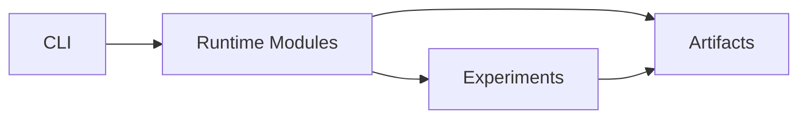
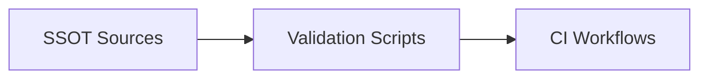

# Architecture

Repository-grounded execution and governance map for BN-Syn.
Back to project landing page: [README.md](../README.md).

## Runtime execution flow

### Key Paths (runtime)

- CLI entrypoint: `src/bnsyn/cli.py`
- Runtime modules: `src/bnsyn/`
- Experiment definitions and runs: `experiments/`
- Generated artifacts: `results/`, `figures/`

## Governance and validation flow

### Key Paths (governance)

- SSOT sources: `specs/`, `schemas/`, `claims/`, `docs/`
- Validation scripts: `scripts/check_internal_links.py`, `scripts/check_quickstart_consistency.py`, `scripts/validate_traceability.py`
- CI workflow runners: `.github/workflows/ci-pr.yml`, `.github/workflows/ci-validation.yml`, `.github/workflows/ci-pr-atomic.yml`, `.github/workflows/docs.yml`
